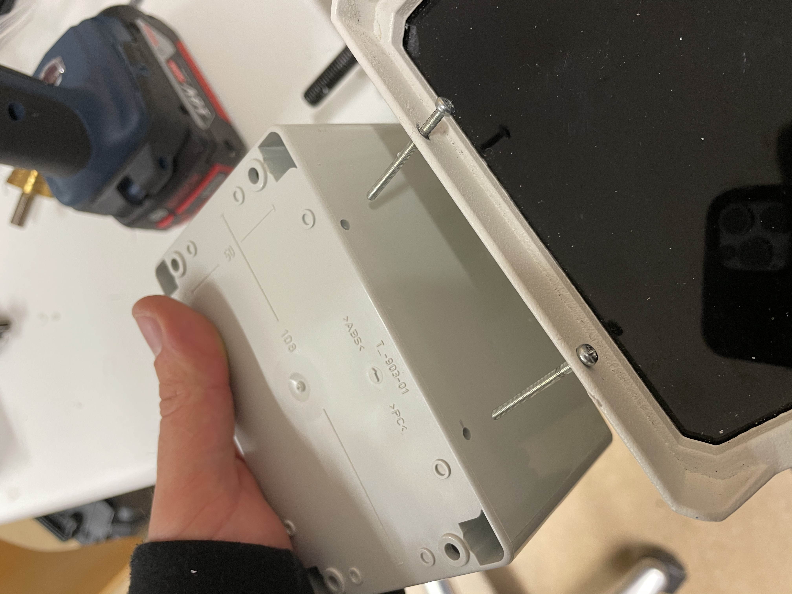

# BatRack in a nutshell 

As an introduction, a few examples are shown here to illustrate what kind of data BatRack can record.
Furthermore, this should give an insight into what conclusions could be possible with this data and which knowledge can be derived.


### Examples:

The following video was recorded by BatRack and was triggered automatically by VHF.
The triggering could also have been done by an audio trigger.

<figure class="video_container">
  <video controls="true" allowfullscreen="true" width="100%">
    <source src="schwaermende_mbecs.mp4" type="video/mp4">
  </video>
</figure>

An example spectrogram of bat calls recorded by BatRack.
(It was post-processed by audacity by hand with moise filter, highpass and lowpass filter)
The possibility to time match both video and audio, BatRack can capture the matching sound for behaviour identified by the video recording.batrack
All this data is collected in the normal environment of the bats and so is an optimal source for machine learning approaches.


The following video shows the match between the incoming vhf signals and the recorded video.
In the lower left corner the vhf signal is plotted.
The current incoming signal is always shown with a red dot.
This allows the current signal to be compared with the video recordings and the incoming signals to be assigned to a specific animal.
This is also an excellent source of data for machine learning.
With this parallel recorded data, the behavior to be recognized can be mapped from the video data to the vhf data and thus a data set can be created for machine learning.

<figure class="video_container"> 
  <video controls="true" allowfullscreen="true" width="100%">
    <source src="vhf_video_match.mp4" type="video/mp4">
  </video>
</figure>

## Parts list

To rebuild BatRack the following components are needed.
In some cases no explicit product name is given, this item are belong very close to the needs of the special project and project area or any part of this type can be purchased.

An overview of the overall design of BatRack is illustrated in the following graphic.


| Position                  | Count | Part in graphic | Price per unit | Price summed up | Product name                                      |
|---------------------------|-------|-----------------|----------------|-----------------|---------------------------------------------------|
| raspberry Pi              |     1 | A               |        40,00 € |         40,00 € | Raspberry pi 3 b+                                 |
| case (big)                |     1 |                 |        20,00 € |         20,00 € | Spelsberg TK PS 2518-11-o                         |
| case (small)              |     1 |                 |        25,00 € |         15,00 € | Spelsberg TG PC 1208-9-o                          |
| ultrasonic microphone     |     1 | F               |       250,00 € |        250,00 € | Ultramic UM250K                                   |
| hq camera                 |     1 | H               |        55,00 € |         55,00 € | Raspberry Pi High Quality Camera                  |
| camera lens               |     1 | H               |        25,00 € |         25,00 € | 6mm lens for Raspberry Pi HQ camera module        |
| relay                     |     1 | E               |         1,40 € |          1,40 € | KY-019 5 V One Channel Relay                      |
| ir led                    |     1 | G               |        70,00 € |         70,00 € |                                                   |
| csi hdmi adapter          |     1 | L               |         9,00 € |          9,00 € | Arducam CSI to HDMI cable                         |
| hdmi feedthrough          |     2 | L               |        12,00 € |         24,00 € | Neutrik NAHDMI-W-B                                |
| hdmi cabel outdoor        |     1 |                 |        39,00 € |         39,00 € | Neutrik NKHDMI-3                                  |
| hdmi cable short          |     2 | L               |         3,00 € |          4,00 € | DeLock Adaptor HDMI-A Male to A Male              |
| sdr stick                 |     1 | B               |        40,00 € |         40,00 € | Nooelec NESDR SMArt v4 SDR                        |
| vhf antenna               |     1 | I               |        50,00 € |         50,00 € |                                                   |
| vhf cable                 |     1 |                 |        15,00 € |         15,00 € |                                                   |
| sma adapter               |     1 |                 |         3,20 € |          3,20 € | Blueberry Each® Coaxial Adaptor                   |
| 12v cigarette lighter     |     1 | D               |         7,00 € |          7,00 € | Carpoint 0523484 Waterproof Buillt-Up Socket 12 V |
| 12v -> 5v adapter         |     1 | D               |         7,00 € |          7,00 € | RAVPower 24 W 4.8 A Dual USB Mini Car Charger     |
| 3D printed mounting plate |     1 |                 |         3,00 € |          3,00 € |                                                   |
| feedthrough led           |     1 |                 |         0,50 € |          0,50 € |                                                   |
| moun microphone           |     1 |                 |         1,50 € |          1,50 € | JSM32KVS-S Cable Connectors M32                   |
| usb a -> mirco usb cable  |     1 |                 |           1,25 |          1,25 € |                                                   |
| lte stick                 |     1 |                 |        45,00 € |         45,00 € | Huawei Surfstick, E3372H-320 LTE                  |
| Subtotal                  |       |                 |                |        737,85 € |                                                   |
| tripod mount              |     1 |                 |        80,00 € |         80,00 € | Gravity GLSTBTV28                                 |
| wam bam box               |     1 |                 |        30,00 € |         30,00 € |                                                   |
| solar charger             |     1 |                 |        20,00 € |         20,00 € |                                                   |
| battery                   |     1 | J               |       150,00 € |        150,00 € |                                                   |
| fuse                      |     1 |                 |        10,00 € |         10,00 € |                                                   |
| power cable               |     1 |                 |         5,00 € |          5,00 € |                                                   |
| power plug male           |     1 |                 |        12,00 € |         12,00 € | Neutrik                                                  |
| power plug female         |     1 |                 |        12,00 € |         12,00 € | Neutrik                                                  |
| solar panel               |     1 | K               |       165,00 € |        165,00 € |                                                   |
|                           |       |                 |                |                 |                                                   |
| Total                     |       |                 |                |      1.947,70 € |                                                   |

## Instruction of building a BatRack prototype

### Step 1 - Main case and infrared led light:

The first thing to start with is the main case of BatRack.
Here, holes are drilled for all required feed-throughs and the components are inserted.
On the left short side both power and the HDMI signal is carried out.


-----

On the opposite side the feed-through for the antenna cable as well as the connection to the IR spotlight is created and the spotlight is screwed directly to the case.


-----

On the top side of the case, two holes are drilled for the attachment to the tripod and two screws are attached.


-----

The construction of the interior can now be continued with the cabling.
For this, power must be drawn from the outside to the 12V distribution and at the same time made available to the IR spotlight via the relay.


-----

In addition, the relay is connected to the Pi, the concrete wiring can be read in the following picture.


-----

Now the 12V to 5V adaption can be installed and the connection of the Pi can be done.


-----

Finally SDR stick, LTE stick and the ultrasonic microphone are connected via USB.


-----

The whole setup of the main box can be seen in the following picture.


### Step 2 - Camera case:

The first thing to do is to drill the holes for the camera, the HDMI feed-through and the attachment to the ir headlight.
Then the camera can be inserted and screwed to the housing.


-----

When this is done, the feed-through for the HDMI signal should be attached.


-----

The inside of the box now looks like this.


-----

At the attached camera should be shielded with a vhf fleece.
Especially the high quality camera send out vhf noise, if the NoIR camera is use this step can be skipped.


-----

The camera box, now ready for use, can be attached to the IR spotlight with two screws.



-----

The result then looks like this.
The camera holds to the housing without any other tools and the HDMI connection to the main box is waterproof.


### Step 3 - Deployment:

The last step is inserting a sd card with an flashed image from [BatRack image page](https://github.com/Nature40/Sensorboxes-Images/releases/tag/batrack-0.1) and deploy BatRack in the field.


-----

You can also watch the live video stream over wifi from any mobile end device.


## Flowchart

The following flowchart illustrates the program flow of the audio and vhf unit.
Here the individual decisions are shown as well as the influence of configuration options on the behavior of the algorithm.
Here it can also be taken that the configuration options offer the possibility of adapting the behavior to the quite special needs.


## Configuring BatRack

BatRack is configured through a configuration file, which is loaded on startup.

It can be accessed via file manager on the sd card in */boot/BatRack.conf* or via ssh on the running system.
For ssh you have to use the command `ssh pi@169.254.0.1` over the wifi of BatRack and use the password *natur*.
When connected the file */boot/BatRack.conf* can be accessed via `nano /boot/BatRack.conf` and can be changed.
The camera can be accessed over *169.254.0.1:81* or *169.254.0.1/camera* or by clicking on the camera unit in the control panel on *169.254.0.1*.
We recorded video in 720p@30hz with the NoIR camera and in 1080p@30hz with the high quality camera.
All setting for the camera can be changed on the same address.

### Continous Operation Mode

In the basic *continuous operation mode*, BatRack is configured through the options available in the `[BatRack]` section.

```ini
[BatRack]
logging_level = INFO
data_path = /data/
duty_cycle_s = 10
always_on = False

; analysis units to instantiate
use_vhf = True
use_audio = True
use_camera = True

; triggers to be evaluated
use_trigger_vhf = True
use_trigger_audio = True
use_trigger_camera = True

[CameraAnalysisUnit]
light_pin = 14

[AudioAnalysisUnit]
threshold_dbfs = 40
highpass_hz = 15000
wave_export_len_s = 300

quiet_threshold_s = 1.0
noise_threshold_s = 0.15

[VHFAnalysisUnit]
freq_center_hz = 150100001
freq_bw_hz = 8000
untrigger_duration_s = 10

; properties of the signals
sig_freqs_mhz = [150.077, 150.038, 150.225, 150.203]
sig_threshold_dbm = 50
sig_duration_threshold_s = 0.02
sig_poll_interval_s = 0.1

; properties for frequency active / passive classification 
freq_active_window_s = 60
freq_active_var = 2.0
freq_active_count = 10
```

In the configuration presented above, BatRack runs continuously 24h a day. 
All of the three analysis units (audio, vhf and camera) are evaluated and in the case that one of those detected a bat, a recording would be triggered. 

### Scheduled Operation Mode

If the `BatRack.conf` configuration file contains any `[run.*]` sections, the software runs in the *scheduled operation mode*, which allows the configuration to change over time. 
In this case BatRack runs as a daemon and instancitates varying configurations at the requested times. 

In the `[run]` sections there are two mandatory variables `start` and `stop`.
In addition to this, all variables of the `[BatRack]` section can be customized in each individual run.


```ini
; define scheduled instances with start and stop parameters
; variables defined in [run.*]-sections override those of [BatRack]
[run.1]
start = 20:00
stop = 01:00

[run.2]
start = 05:00
stop = 06:00

use_trigger_vhf = False
use_trigger_audio = False
use_trigger_camera = False
```

In the examples presented above, a trigger-based run (as defined in the `[BatRack]` section defined in the first example) would be running starting 8 pm until 1 am at night.

Second, a continuous recording would run from 5 until 6 am. 
In this second example none of the triggers are actually used (`use_trigger_* = False`), which is internally interpreted as a continuous recording.

#### Overlapping schedulings

Since some of the sensors are mutual exclusive, only one instance of BatRack is allowed to run at a time. 
This is also the case for scheduled runs.
If a run is configured to start before an ongoing job ends, it will wait for the running job to finish.

## Installation

BatRack is currently only supported on the Raspberry Pi platform, since it depends on its GPIO port interface. 
The required python libraries are defined as dependecies and are automatically installed when using `pip`.
`numpy` as well as `pyaudio` require binaray libraries, which need to be installed manually. 
In the case of Raspbian / Raspberry Pi OS, this can be achieved using `apt`:

```bash
apt-get install -y python3-numpy python3-pyaudio
python3 -m pip install .
```